# Articles API on Kubernetes

A CRUD REST API in Node.js backed by a 3-node MongoDB replica set, running on a Minikube cluster that Terraform brings up. Everything else — ingress, Argo CD, Prometheus, Grafana — installs on top through Helm. GitOps via Argo CD if you want it.

## What's in here

```
backend/                     Node.js source + Dockerfile
terraform/                   Minikube + wrapped Helm charts (ingress, argocd, prometheus-stack)
helm-templates/              chart definitions
  argo-cd-9.5.21/            wrapper — declares upstream argo-cd 9.5.21 as a dependency
  ingress-nginx-4.11.2/      wrapper
  kube-prometheus-stack-62.6.0/  wrapper (Prometheus + Grafana + node-exporter + kube-state-metrics)
  articles-backend/          hand-written chart for our app
  mongodb/                   hand-written chart, 3-member replica set with keyfile auth
helm-overrides/              one folder per chart, one file `custom-values.yaml`
  argo-cd/
  ingress-nginx/
  kube-prometheus-stack/
  articles-backend/
  mongodb/
argocd/
  master-argo-app.yaml       root app-of-apps
  applications/              one Application per chart, each points at helm-templates + helm-overrides
scripts/
  deploy.sh                  one-shot bring-up (terraform + docker build + helm install)
  test-api.sh                curl all five endpoints end-to-end
```

## How the pieces fit

```
       curl / postman
             │
             ▼
       ingress-nginx      (host: articles.local)
             │
             ▼
      articles-backend     3 replicas, HPA 3-10, anti-affinity soft
             │
             ▼
       mongodb rs0        3-member statefulset, keyfile auth, pdb maxUnavail 1
                          all three seeds in the connection string
```

Prometheus scrapes the backend `/metrics` via a ServiceMonitor. Grafana ships pre-provisioned with an Articles API dashboard.


Argo CD then reads `argocd/applications/` and creates child Apps for:
- argo-cd (self-manages)
- ingress-nginx
- kube-prometheus-stack
- mongodb
- articles-backend

## Observability

Prometheus + Grafana come with the `kube-prometheus-stack` chart. The backend exposes `/metrics` on port 3000 (Node.js default runtime metrics + a custom `http_request_duration_seconds` histogram). The backend chart also ships a `ServiceMonitor` so Prometheus finds it automatically — no annotation-based scraping needed.

Access:
- Grafana: `http://grafana.local` — admin / admin. There's a dashboard called "Articles API" under the "Articles" folder with RPS and p95 latency panels.
- Prometheus: `http://prometheus.local` — for ad-hoc PromQL.


Traffic flow when you `curl http://articles.local`:

1. Your shell resolves `articles.local` → `127.0.0.1` (via `/etc/hosts`).
2. `sudo minikube tunnel` (running in a second terminal) forwards `127.0.0.1:80` on your host to the ingress-nginx pod inside Minikube. Without the tunnel, nothing on your host would reach the cluster's ingress.
3. Ingress-nginx sees `Host: articles.local` in the request, looks up which Ingress resource claims that hostname, and forwards to the backend Service.
4. Backend Service round-robins to one of the backend pods.

Same story for the other three hostnames, just different backends.

## HA — what stops it going down

- Backend: 3 replicas, HPA scales 3-10 on CPU 70%, rolling update `maxSurge:1 maxUnavailable:0`, PDB `maxUnavailable:1`, soft anti-affinity across nodes.
- MongoDB: 3-member replica set, quorum stays at 2/3 even during a single pod loss, PDB `maxUnavailable:1`, soft anti-affinity.
- Probes on both: startup + readiness + liveness. Backend's readiness probe checks the mongo connection state before saying "ready", so kubectl doesn't route traffic to a pod that hasn't finished connecting.
- Mongo connection uses a replica-set-aware URI with all three seed hosts, so the driver handles failover.

## Design notes

Longer writeup in `docs/DESIGN_DECISIONS.md`.

## Screenshots — end-to-end validation

All screenshots taken from the running local demo. Full-size files under `docs/screenshots/`.

### Infrastructure provisioning


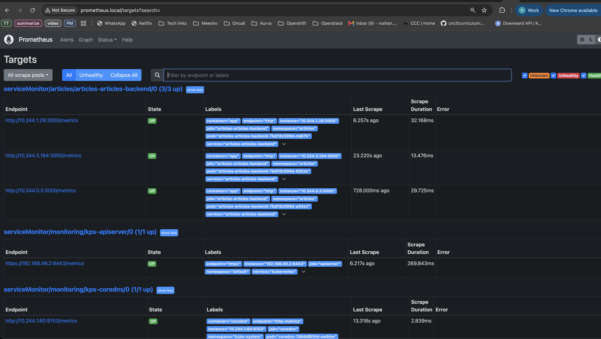

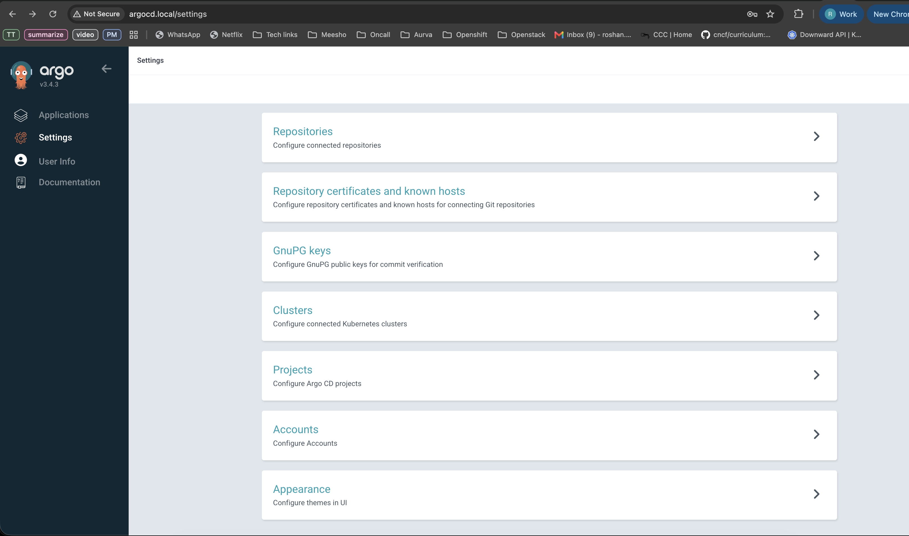

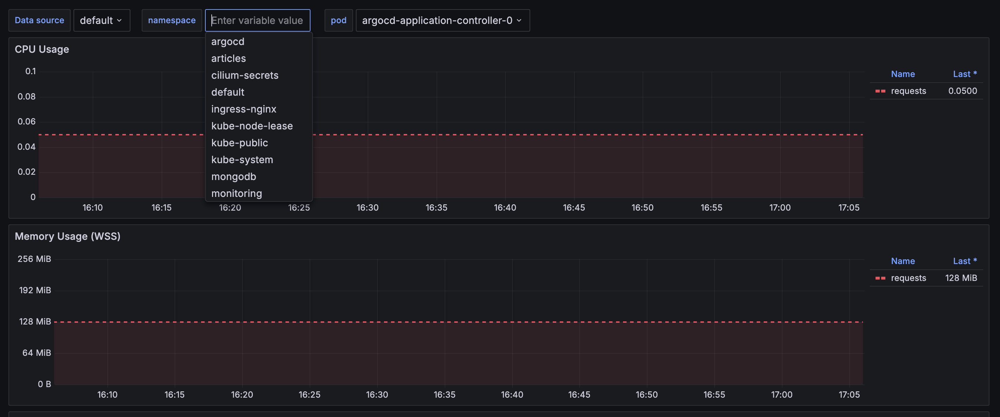

**`scripts/deploy.sh` runs terraform apply → docker build → minikube image load → helm install:**

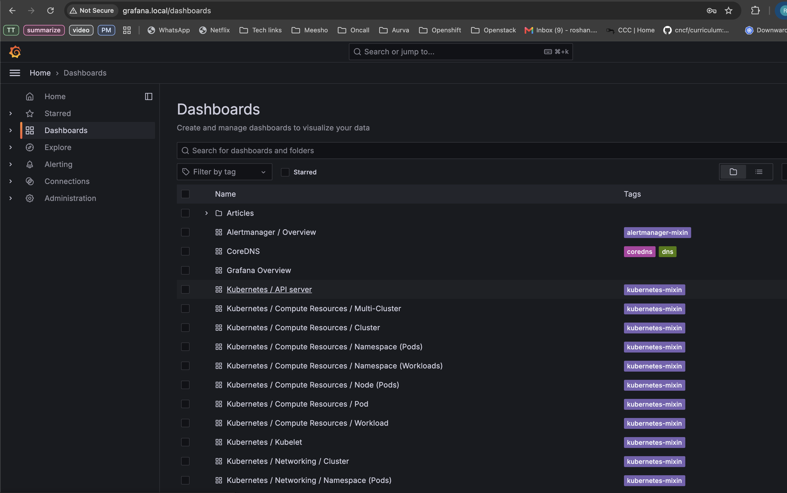

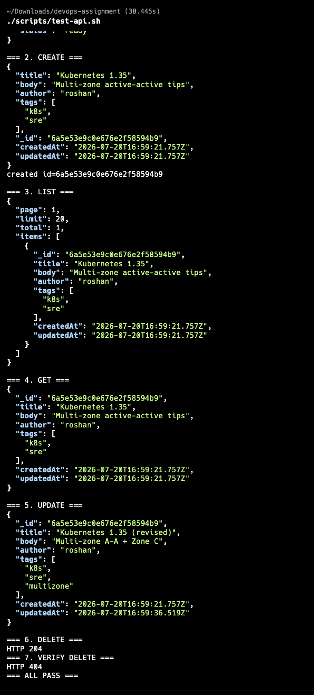

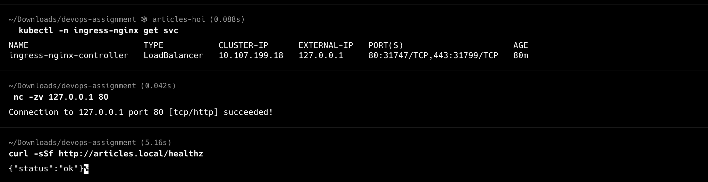

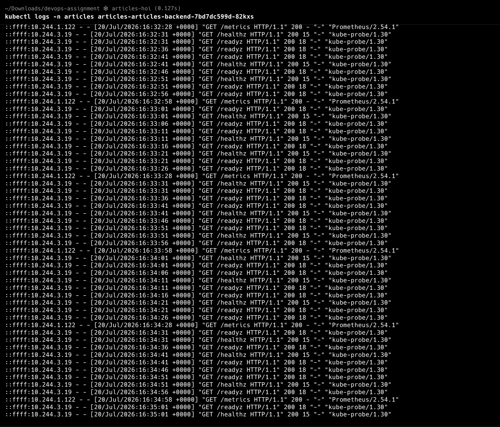

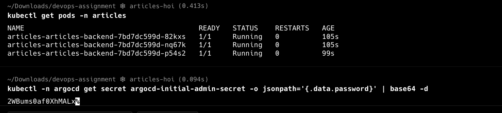

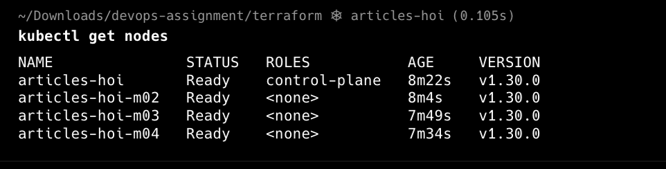

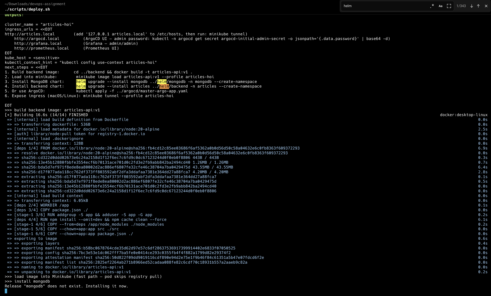

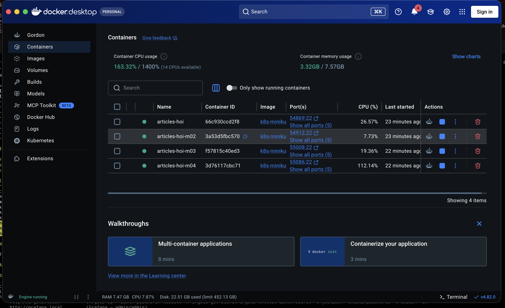

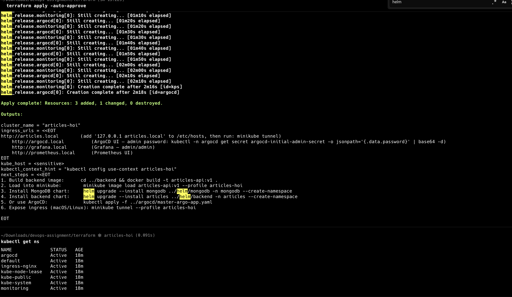
